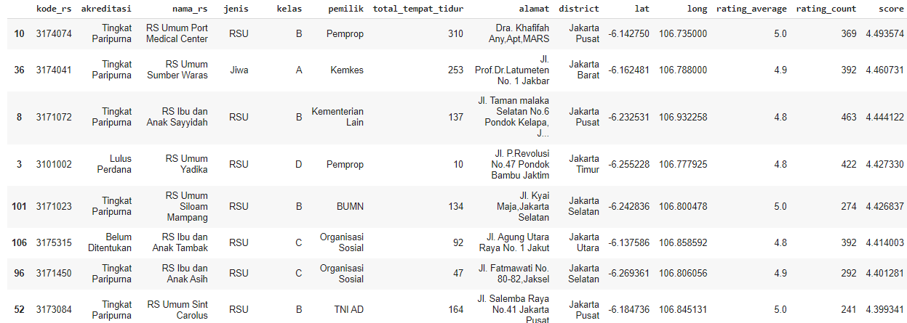

# healthio-ml
Repository for healthio's ml works

## Directory
validasi_bpjs = notebook, dataset, and the exported model for validation feature
 
data_rs = consist of an individual datasets, a united dataset, and notebooks for exporting them to json for Firebase
 

## Hospital Data
Data is collected manually from various sources, and various CSVs
 
But mostly from: http://sirs.yankes.kemkes.go.id/fo/home/akreditasi
 
We only use hospitals around Jakarta for efficiency purpose. Then, the CSVs is merged into one large dataset and converted to JSON for Firebase
 

## Surat Rujukan BPJS Validation
For this validation, we use binary classification method to validate if the picture taken is a real BPJS form or not
### 1. Data Collection
The data for this validation is mostly from Google Image and random image generator script (for the invalid dataset). Then, the two datasets are seperated into two different directories.

### 2. Training the model
To feed the images into the model, we use ImageDataGenerator from Tensorflow and we use transfer learning to make the training easier. However, the exported tflite model is too big and we made our own sequential model with four pairs of Conv2D and max_pooling layers and two dense layers with 512 units and 2 units for the output
 

 
We train the model with adam optimizer and categorical_entropy loss for 10 epochs. The accuracy and loss for training and validation can be seen below
<table>
  <tr>
    <td>Accuracy</td>
    <td>Loss</td>
  </tr>
  <tr>
    <td></td>
    <td></td>
  </tr>
</table>
 

### 3. Inference
After tuning and exporting the model into tflite, we deploy it on our android application locally. We also add label.txt for the inference's sake.
After validating the picture taken, we crop the necessary part of the picture and do an OCR to extract important feature such as
  - Nama pasien
  - Diagnosa
  - Nama Rumah Sakit
  - Nomor BPJS
  - dll
<table>
  <tr>
    <td>Picture taken</td>
    <td>Validation and cropping</td>
  </tr>
  <tr>
    <td></td>
    <td></td>
  </tr>
</table>
When we got the RS name, we make a new intent to that RS
